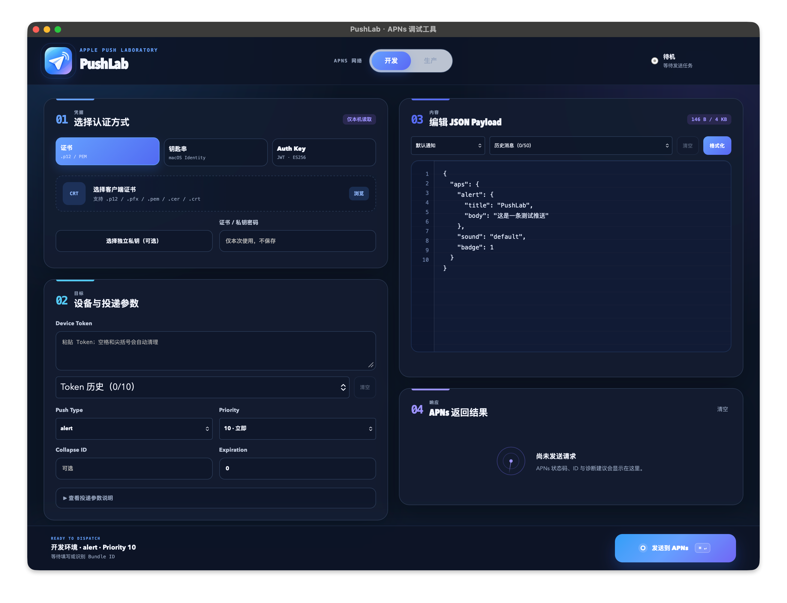
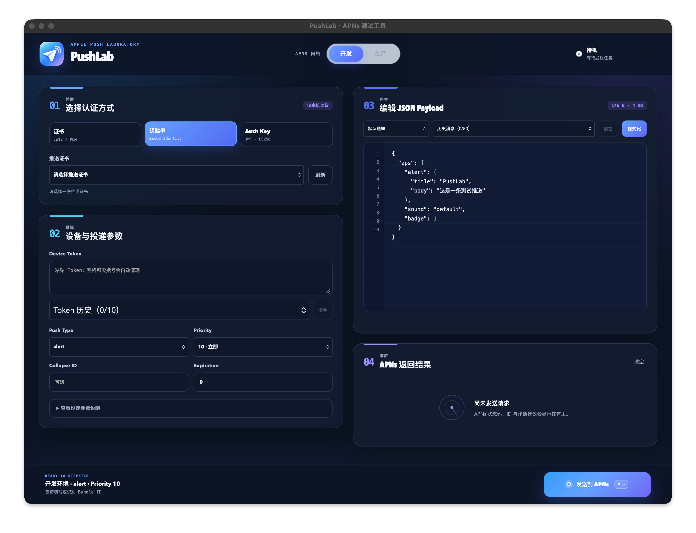
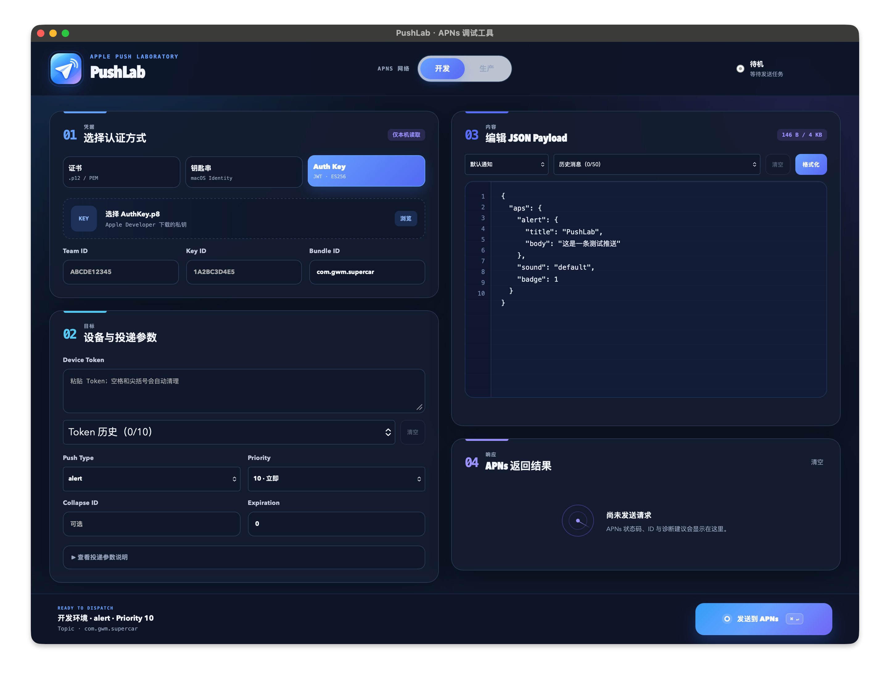

# PushLab

PushLab 是一个基于 Tauri 2 的 macOS APNs 推送调试工具。前端使用 TypeScript + Vite，系统能力、凭据读取、APNs HTTP/2 请求和本地持久化全部由 Rust 后端提供。

项目已于 2026 年 9 月 28 日完成桌面框架重建。新工程不包含 Electron、Electrobun、Bun 主进程、Hutch、Sparkle、旧 RPC 或旧原生辅助库代码。

## 界面预览

### 证书文件



### macOS 钥匙串



### Auth Key（.p8）



## 功能

### 三种 APNs 认证方式

- Auth Key（`.p8`）
  - Team ID、Key ID、Bundle ID
  - ES256 Provider Token
  - 私钥只在发送时读取，不持久化内容
- macOS 钥匙串
  - 直接枚举包含私钥的 Apple 推送身份
  - 显示 Bundle ID、Team ID、组织、签发者、有效期和指纹
  - 使用 Security.framework 导出短生命周期的内存 PKCS#12 身份
- 证书文件
  - 支持 `.p12`、`.pfx`、`.pem`、`.cer`、`.crt`
  - 支持独立 `.key` / `.pem` 私钥
  - 支持证书和加密私钥密码

### 推送与诊断

- APNs 开发 / 生产环境
- HTTP/2 直连 APNs
- `alert`、`background`、`voip`、`liveactivity` 等 Push Type
- Priority、Collapse ID、Expiration
- Device Token 自动清理
- Payload JSON 校验、格式化与大小限制
- 常见 APNs 错误原因和处理建议
- APNs ID、Host、状态码和耗时

### 本地体验

- 最近 10 条 Device Token 历史
- 最近 50 条 Payload 历史
- 非敏感配置自动保存
- 证书密码和私钥内容不持久化
- 中文 macOS 原生菜单
- `⌘ Enter` 快捷发送
- Tauri 签名更新包与 GitHub Release 更新检查

## 架构

```text
PushLab/
├── src/                         # 全新 WebView 前端
│   ├── main.ts                  # 页面状态、Tauri Command、交互
│   ├── style.css                # 全新视觉系统
│   └── types.ts                 # 前端数据契约
├── src-tauri/
│   ├── src/
│   │   ├── apns.rs              # APNs 校验、JWT、HTTP/2、TLS
│   │   ├── certificate.rs       # X.509 / Auth Key 检查
│   │   ├── keychain.rs          # Security.framework 钥匙串接入
│   │   ├── storage.rs           # 设置与历史记录
│   │   ├── error_guide.rs       # APNs 错误解释
│   │   ├── models.rs            # Rust 数据模型
│   │   └── lib.rs               # Tauri Command、插件、原生菜单
│   ├── capabilities/            # Tauri 权限边界
│   └── tauri.conf.json          # 窗口、Bundle、Updater 配置
├── scripts/
│   ├── setup-updater-key.mjs    # 初始化本地更新签名密钥
│   └── tauri-build.mjs          # 从钥匙串加载签名信息并构建
└── .github/workflows/release.yml
```

## 环境要求

- macOS 12 或更高版本
- Node.js 20 或更高版本
- Rust 1.90 或更高版本
- Xcode Command Line Tools

## 开发

安装依赖：

```bash
npm install
```

启动 Tauri 开发模式：

```bash
npm run dev
```

静态检查：

```bash
npm run check
```

运行 Rust 测试：

```bash
npm test
```

## 构建

第一次在本机生成可更新的 Release 包前，初始化 Tauri Updater 签名密钥：

```bash
npm run setup:updater
```

该命令会：

- 将私钥保存到 `~/.tauri/pushlab-updater.key`
- 将私钥密码保存到 macOS 钥匙串的 `PushLab.TauriUpdater` 服务
- 将公钥写入 `src-tauri/tauri.conf.json`

之后执行：

```bash
npm run build
```

产物位于：

```text
src-tauri/target/release/bundle/
```

包括 `.app`、`.dmg`、更新归档和 `.sig` 签名文件。

## GitHub Release

推送 `v*` 标签会触发 `.github/workflows/release.yml`。仓库需要配置：

- `TAURI_SIGNING_PRIVATE_KEY`
- `TAURI_SIGNING_PRIVATE_KEY_PASSWORD`

`TAURI_SIGNING_PRIVATE_KEY` 的值是 `~/.tauri/pushlab-updater.key` 文件内容。工作流会构建 macOS Apple Silicon 包、创建 GitHub Release，并上传 Tauri Updater 使用的 `latest.json`。

## 用户数据兼容

应用标识保持为 `dev.pushlab.app`，设置与历史记录继续使用以下文件名：

- `push-lab-settings.json`
- `push-lab-payload-history.json`
- `push-lab-device-token-history.json`

首次读取时，Tauri 会在新数据目录不存在对应文件的前提下，依次从旧版 `stable`、`dev` 数据目录迁移。已有 Tauri 数据不会被覆盖，因此旧版本保存的非敏感配置和历史记录可以继续使用。

本地构建默认使用 ad-hoc 签名，适合开发、测试和本机运行。对外分发仍需配置 Apple Developer ID Application 证书，并完成 Apple notarization（公证）。

正式发布时可通过 `APPLE_SIGNING_IDENTITY` 覆盖配置中的 ad-hoc 身份，同时在 CI 导入 Developer ID Application 证书，并配置 `APPLE_ID`、`APPLE_PASSWORD`、`APPLE_TEAM_ID`，或等价的 App Store Connect API Key 公证凭据。

## 安全说明

- PushLab 仅用于开发和调试，不提供批量推送能力。
- `.p8`、私钥、证书密码不会写入设置文件。
- 钥匙串身份导出仅存在于进程内存中，并使用随机临时密码保护。
- 发布签名私钥不进入 Git 仓库。
